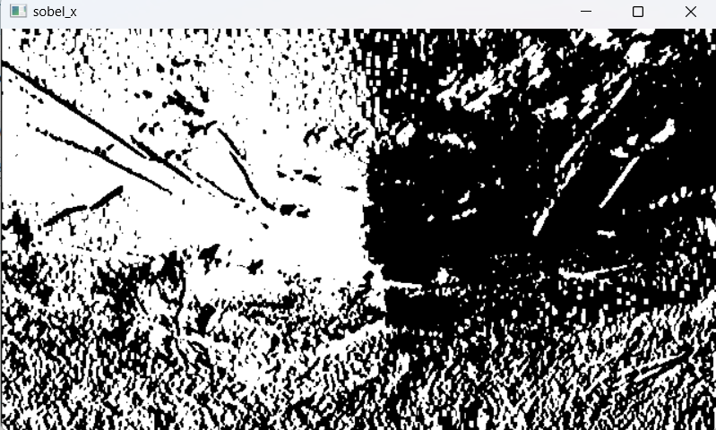
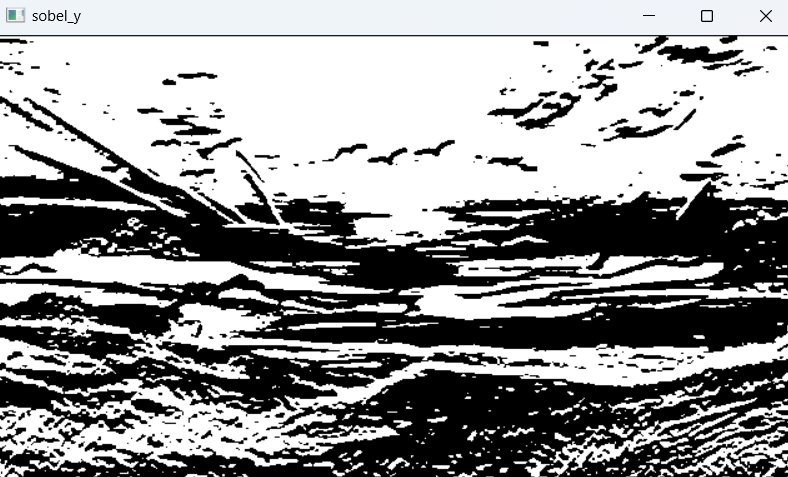
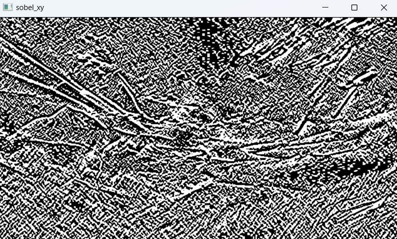
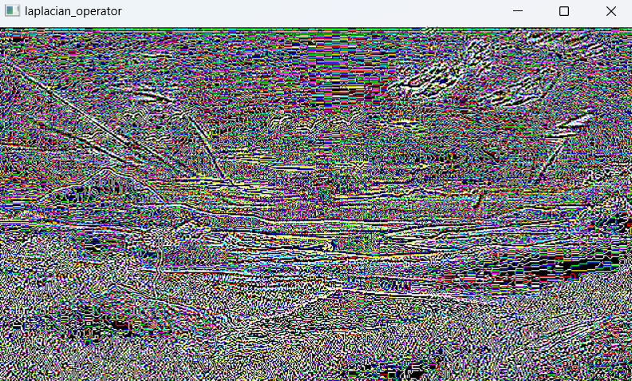
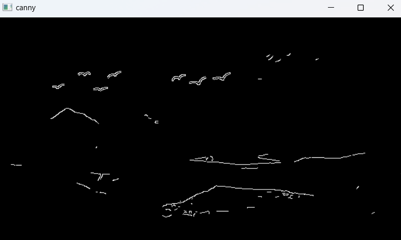

# EDGE-DETECTION
## Aim:
To perform edge detection using Sobel, Laplacian, and Canny edge detectors.

## Software Required:
Anaconda - Python 3.7

## Algorithm:
### Step1:
Import all the necessary modules for the program.

### Step2:
Load a image using imread() from cv2 module.

### Step3:
Convert the image to grayscale

### Step4:
Using Sobel operator from cv2,detect the edges of the image.

### Step5:
Using Laplacian operator from cv2,detect the edges of the image and Using Canny operator from cv2,detect the edges of the image.

## Program:
```
DEVELOPED BY: ADHITHYARAM D
REGISTER NO: 212222230008
```
```python

import cv2
import matplotlib.pyplot as plt
img=cv2.imread("flight.jpg",0)
gray=cv2.cvtColor(img,cv2.COLOR_GRAY2RGB)
gray = cv2.GaussianBlur(gray,(3,3),0)

sobelx = cv2.Sobel(gray,cv2.CV_64F,1,0,ksize=5)
plt.imshow(sobelx,cmap='gray')
plt.title("Sobel X axis")
plt.axis("off")
plt.show()

sobely = cv2.Sobel(gray,cv2.CV_64F,0,1,ksize=5)
plt.imshow(sobely,cmap='gray')
plt.title("Sobel Y axis")
plt.axis("off")
plt.show()

sobelxy = cv2.Sobel(gray,cv2.CV_64F,1,1,ksize=5)
plt.imshow(sobelxy,cmap='gray')
plt.title("Sobel XY axis")
plt.axis("off")
plt.show()

lap=cv2.Laplacian(gray,cv2.CV_64F)
plt.imshow(lap,cmap='gray')
plt.title("Laplacian Edge Detector")
plt.axis("off")
plt.show()

canny=cv2.Canny(gray,120,150)
plt.imshow(canny,cmap='gray')
plt.title("Canny Edge Detector")
plt.axis("off")
plt.show()
```
## Output:
### ORIGINAL IMAGE

### SOBEL EDGE DETECTOR






### LAPLACIAN EDGE DETECTOR


### CANNY EDGE DETECTOR


## Result:
Thus the edges are detected using Sobel, Laplacian, and Canny edge detectors.